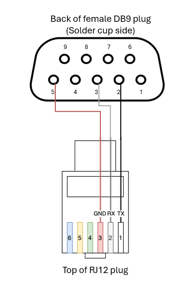

# Fixed Base Manager
Manage a u-Blox GPS fixed base (RTK/RTCM3) installation with Raspberry Pi

### DISCLAIMER
This is very much a work in progress. The current (and only) release is an early alpha version and likely unstable.

---
Provides a Raspberry Pi served web app to ease the pain involved with configuring and maintaining a u-Blox GPS Fixed Base (RTK/RTCM3) installation. Optionally enables a local TCP connection to the GPS module and an NTRIP transport service to stream data to an internet based NTRIP caster.

Uses a Vite managed React framework and NodeJS + Express backend.

Developed on a Raspberry Pi 5 (4GB). Tested on a Pi Zero 2 W and Pi 3B (see recommended hardware below).

---
### REQUIREMENTS

* Raspberry Pi Zero 2 W, 3, 4, or 5
* A quality micro SD card (8GB or more)
* Internet connectivity (wired Ethernet is best, but WiFi is acceptable)
* 64-bit Debian-based OS (recommend headless Bullseye or Bookworm - choose the "Lite" option)
* A u-Blox GPS module capable of supporting fixed base operation (Zed-F9P, Neo-M8P-2, etc)
* A well placed GPS antenna in a fixed location away from obstacles/obstructions

> NOTE: This app may run on Orange Pi, Libre, Odroid, etc, but those options are untested. Testing to date shows 32-bit OS incompatibility, so the older Pi Zero W is not a candidate for installation at present.

---
### INSTALLATION

* Prepare an SD card for the Raspberry Pi (recommend [Raspberry Pi Imager](https://www.raspberrypi.com/software/)).
* Configure the Raspberry Pi for internet access
* Connect the GPS module to a USB port
* Run the following command as a user with sudo privileges (DO NOT actually run it with the sudo prefix):
```
bash -c "$(curl -fsSL https://raw.githubusercontent.com/yuri-rage/ublox-fixed-base-manager/master/fixedbase-installer.sh)"
```

When the script completes, a link to the web app will be shown. Copy the link to a web browser.

The following command can be used to monitor server output as desired:
```
journalctl --user-unit fixedbase.service -f
```

> NOTE: While some of the requisite libraries and executables are installed globally, the web app is installed in the user's home directory, and `fixedbase.service` is run at the user level, which should offer some measure of security over running network exposed services as root. Speaking of security, the NTRIP caster password is transmitted and saved as plain text (and even RTK2Go will email it in plain text). Use a good/well-formed password, but DO NOT use the same password for anything else.

---
### UPDATES

To update, run the installer command again at any time. If an update is available, it will be installed.

If no update is available, the script will present an option to reinstall.

---
### RECOMMENDED HARDWARE

A u-Blox Zed-F9P GPS module is the gold standard for reasonably affordable RTK GPS. I prefer the [SimpleRTK2B breakout board from ArduSimple](https://www.ardusimple.com/product/simplertk2b/) (also available through [Mouser](https://www.mouser.com/manufacturer/ardusimple/) or [DigiKey](https://www.digikey.com/en/supplier-centers/eps-works-sl-ardusimple)).

I created this app to be fairly lean, so it should run well on a Raspberry Pi Zero 2 W. As such, current draw should be minimal, allowing a small solar panel (50-100W) and battery (10-20Ah) to power it indefinitely.

Here is some of the hardware I used for my own installation:

* [SanDisk Ultra 32GB Micro SD Cards](https://www.amazon.com/gp/product/B08J4HJ98L/)
* [12-24V to 5V 3A Micro USB Power Adapter](https://www.amazon.com/gp/product/B0B6NZBWV4/)

If using a Pi Zero 2 W, you'll need an OTG USB adapter/hub to connect the GPS module.

* [Three Port OTG USB/Ethernet Hub](https://www.amazon.com/gp/product/B083VXQKD1/)

Depending on proximity of the base to the nearest WiFi access point, it may be preferable to to use an external WiFi adapter rather than relying on the tiny onboard WiFi antenna. This adapter draws ~250mW when in use.

* [AC600 External WiFi Adapter](https://www.amazon.com/gp/product/B07Z31W68W/)

To completely disable onboard WiFi and rely on an external USB adapter, edit `/boot/config.txt`, add the following line, and reboot:
```
dtoverlay=disable-WiFi
```

---
### RENOGY SOLAR CHARGE CONTROLLER

The app supports additional features when a Renogy solar charge controller is in use, including safe shutdown on low voltage.

The [Renogy Wanderer (10A)](https://www.amazon.com/gp/product/B07NPDWZJ7/) is fully supported. Other Renogy models should work but remain untested.

An [RS232 to USB converter](https://www.amazon.com/gp/product/B003WOWBBW/) is required for Renogy data to be available in the app.

The app uses a foundation inspired by the [NodeRenogy](https://github.com/sophienyaa/NodeRenogy) project, and additional information can be found on its landing page.

The RS232 adapter pinout provided by [NodeRenogy](https://github.com/sophienyaa/NodeRenogy) is slightly confusing. A  modified reference image is provided below for clarity.



---
### REFINING FIXED BASE SURVEY LOCATION
#### (AND GNSS DATA POST-PROCESSING/PPK)

While a survey-in over the course of 12-24 hours can refine position to some extent, it does not offer the absolute accuracy that many assume, and is often only accurate to within 1m to 1.5m, despite the accuracy figure presented in UBX-NAV-SVIN messages. For the best possible absolute accuracy, accomplish a physical survey of the fixed base antenna location via a professional service. Failing that, use a governmental CORS source or a second fixed base over a known reference point (survey marker/monument) and connect the newly constructed base station to it during a survey-in.

Otherwise, post-processing of logged GNSS observations can be used to refine position to within a few cm (or even a few mm). This section is rather incomplete but should get you pointed in the right direction for post-processing log data (PPK analysis).

* Optionally, enable the local network repeater service on the Network Services tab
    * Once enabled, connect u-Center via TCP and enable the NTRIP Client feature
    * This will enable logging of your local NTRIP/CORS source for later analysis
* Enable logging on the Utilities tab
* Allow at least 5 minutes of logging to take place
    * Several hours is best
    * Logs will grow at ~15MB/hr - do not leave logging enabled indefinitely, as they will fill your disk!

After desired sample time:
* Disable logging and download the newest log files from `~/fixedbase/logs`
* Log files are date/time stamped in the format, `<PREFIX>-YYYYMMDD-HHMMSS`
    * If the OS is properly configured and connected to the Internet, the date/time stamp should reflect reasonably accurate UTC time
* The file prefixed `EXTERN-IN` is the incoming data from u-Center
    * Should largely be RTCM3 (source of base observations for PPK if used)
* The file prefixed `UBX-OUT` is your module's UBX data
    * Source of rover observations for PPK
* The file prefixed `RTCM3-OUT` is your module's RTCM3 data
    * Alternate source of rover observations for PPK
* Log files can be converted to RINEX for analysis by RTKLib or KernelSat RINEX Tools (among others)
* Once converted to RINEX format, PPK analysis is possible through RTKLib, KernelSat TOPAZ, etc

**POST-PROCESSING RESOURCES:**

* [RTKExplorer fork of RTKLib](https://github.com/rtklibexplorer/RTKLIB/releases) - frequently recommended in forum discussions as the preferred version of RTKLib.
* [RTKLib_PPK.conf](https://raw.githubusercontent.com/yuri-rage/ublox-fixed-base-manager/master/ppk-extras/RTKLib_PPK.conf) - a configuration file that seems to work well when post-processing with the fork of RTKLib linked above.
* [RTKLib_PPK_Analysis.xlsx](https://raw.githubusercontent.com/yuri-rage/ublox-fixed-base-manager/master/ppk-extras/RTKLib_PPK_Analysis.xlsx) - Excel worksheet for use with RKTLib post-processing.
* [KernelSat](https://kernelsat.com/kss.php) offers some free online GPS data processing tools.
* [NOAA User Friendly CORS](https://geodesy.noaa.gov/UFCORS/) - publicly available CORS data for post-processing
* [NOAA CORS Network Map](https://arcg.is/18fWq8) - map of NOAA CORS stations
* [This topic on DroneDeploy](https://forum.dronedeploy.com/t/how-to-ppk-processing-with-rtklib-phantom-4-rtk/13217) discusses use of online CORS sources and RTKLib analysis

---
### ADVANCED CONFIGURATION

Settings are stored at `~/fixedbase/config/default.json` and are largely managed via the web interface. However, a few settings do not appear in the web app and may be useful for specialized installations.

*  `useMSM7` If true, replaces the default MSM4 RTCM3 message set with MSM7. These messages require higher bandwidth and may not be suitable for long range telemetry. MSM7 typically offers little to no practical precision gain over MSM4.

* `rate1005` This section specifies the message interval (in whole seconds) for the Stationary RTK Reference Station ARP (1005) message when RTCM3 is enabled on the specified port. Default is 5 seconds, which is adequate for most applications. Reducing it to 1 will send the message at 1Hz.

* `rate1230` Same as `rate1005` above, but applies to the GLONASS L1 and L2 Code-Phase Biases (1230) message.

* `enableUbxNavSat` Enables/disables the UBX-NAV-SAT message on the specified port(s). If connecting via TCP with u-Center, it may be preferable to enable this on the primary port, since u-Center uses it to populate many of the graphical components. Enabling NMEA on any given port will have a similar effect at the cost of additional bandwidth.

Default advanced settings are as follows:

```
    "advanced": {
        "useMSM7": false,
        "rate1005": {
            "usb": 5,
            "uart1": 5,
            "uart2": 5
        },
        "rate1230": {
            "usb": 5,
            "uart1": 5,
            "uart2": 5
        },
        "enableUbxNavSat": {
            "usb": true,
            "uart1": false,
            "uart2": false
        }
    }
```

---
### CONTRIBUTING

The project is a Vite managed React frontend and makes heavy use of Preact signals in place of the usual state management objects and hooks. Shadcn/ui comprises the bulk of the basic components and theming, alongside TailwindCSS.

Vite also handles running the ExpressJS backend during development (via `npm run dev`), and the `build-release.sh` script packages everything for production (which might be a bit hacky, but it's working well).

I am no seasoned web developer, as you'll likely find if you read through the source. As such, I may not always be well-equipped to handle complex pull requests. However, I'm open to suggestion, and I will endeavor to merge features and bug fixes that are well formed (and/or well explained).

---
### ACKNOWLEDGEMENTS

Thanks to @lakowske for the [ecef-projector](https://github.com/lakowske/ecef-projector) codebase. I refactored it slightly to make use of more modern JS and TS constructs, but the algorithms and math are unchanged.

Thanks also to @sophienyaa for the [NodeRenogy](https://github.com/sophienyaa/NodeRenogy) project. I used `renogy.js` as the basis for my implementation of the solar charge controller feature.

---
### LICENSE (MIT)

Copyright 2024 -- Yuri

Permission is hereby granted, free of charge, to any person obtaining a copy of this software and associated documentation files (the “Software”), to deal in the Software without restriction, including without limitation the rights to use, copy, modify, merge, publish, distribute, sublicense, and/or sell copies of the Software, and to permit persons to whom the Software is furnished to do so, subject to the following conditions:

The above copyright notice and this permission notice shall be included in all copies or substantial portions of the Software.

THE SOFTWARE IS PROVIDED “AS IS”, WITHOUT WARRANTY OF ANY KIND, EXPRESS OR IMPLIED, INCLUDING BUT NOT LIMITED TO THE WARRANTIES OF MERCHANTABILITY, FITNESS FOR A PARTICULAR PURPOSE AND NONINFRINGEMENT. IN NO EVENT SHALL THE AUTHORS OR COPYRIGHT HOLDERS BE LIABLE FOR ANY CLAIM, DAMAGES OR OTHER LIABILITY, WHETHER IN AN ACTION OF CONTRACT, TORT OR OTHERWISE, ARISING FROM, OUT OF OR IN CONNECTION WITH THE SOFTWARE OR THE USE OR OTHER DEALINGS IN THE SOFTWARE.